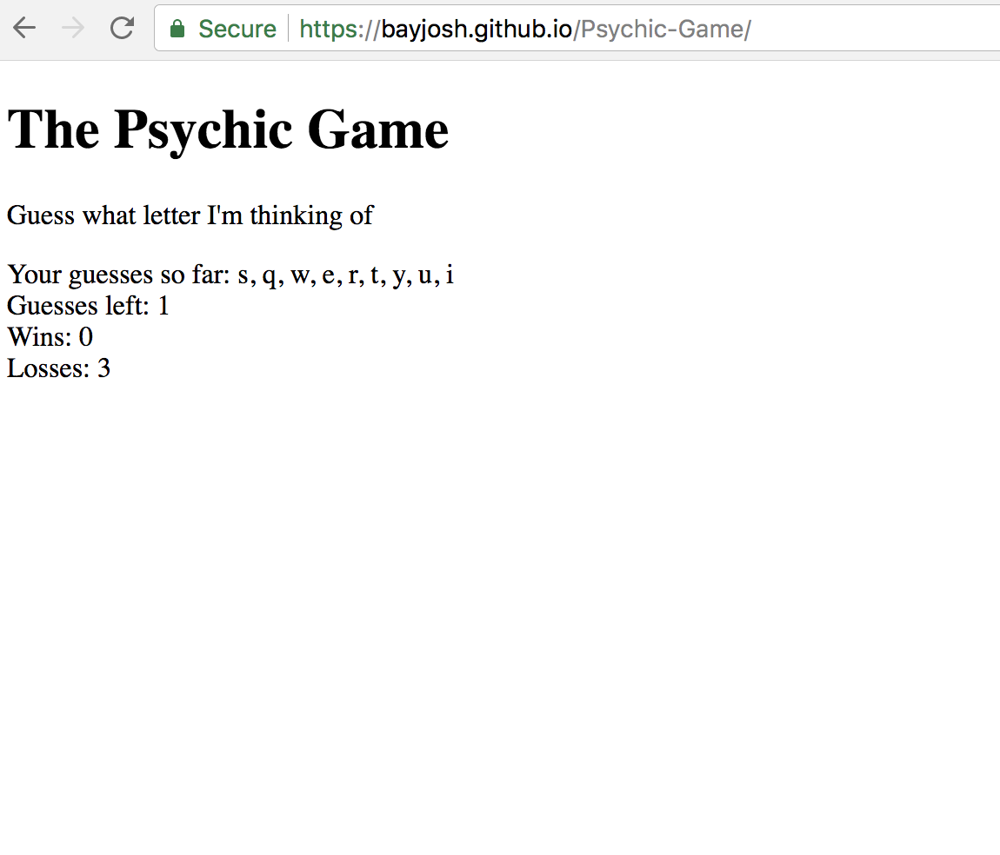

# Psychic-Game

Link to game: https://bayjosh.github.io/Psychic-Game/

Screenshot can be found here: 

This game requires the user to predict a random character that the computer has selected. The user will have 10 attempts to guess the correct character before incurring a loss. If the user guess the character correctly they will record a win.

Technologies used: 
javascript 

Limitations: 
- Further iterations of this game should limit the character choices the user can press to only lower-case a-z characters and restrict the user from guessing the same character twice. Alerts should be used to notify the user of these restrictions as well as winning/losing the game
